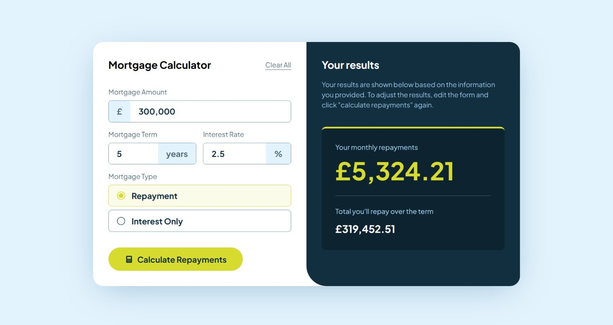
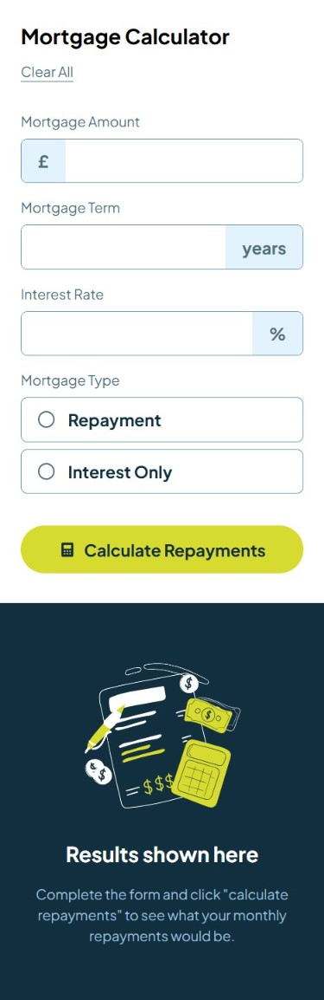

# Mortgage Calculator

This calculator helps you find out your monthly and total mortgage repayments. This was built as part of the [Mortgage repayment calculator challenge on Frontend Mentor](https://www.frontendmentor.io/challenges/mortgage-repayment-calculator-Galx1LXK73).

## Table of contents

- [Overview](#overview)
  - [The challenge](#the-challenge)
  - [Screenshot](#screenshot)
  - [Links](#links)
  - [Built with](#built-with)
- [Author](#author)

## Overview

### The challenge

Users should be able to:

- Input mortgage information and see monthly repayment and total repayment amounts after submitting the form
- See form validation messages if any field is incomplete
- Complete the form only using their keyboard
- View the optimal layout for the interface depending on their device's screen size
- See hover and focus states for all interactive elements on the page

### Screenshots

|            Desktop             |            Mobile             |
| :----------------------------: | :---------------------------: |
|  |  |

### Links

- [Live Site URL](https://syedalimansoor.github.io/mortgage-calculator)

### Built with

- React
- Typescript
- Vite

## Author

Syed Ali Mansoor

- Instagram - [@alimansoor.dev](https://www.instagram.com/alimansoor.dev)
- Github - [@syedalimansoor](https://github.com/syedalimansoor)
- LinkedIn - [@syed-ali-mansoor](https://www.linkedin.com/in/syed-ali-mansoor/)
